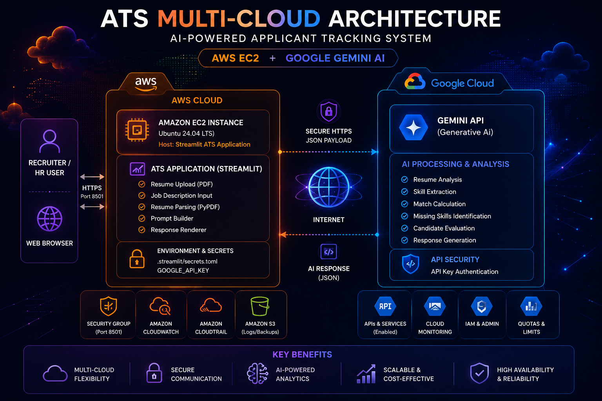
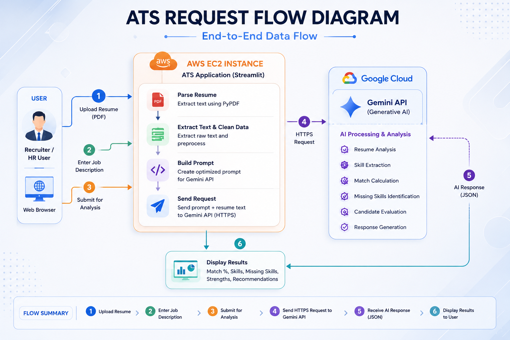
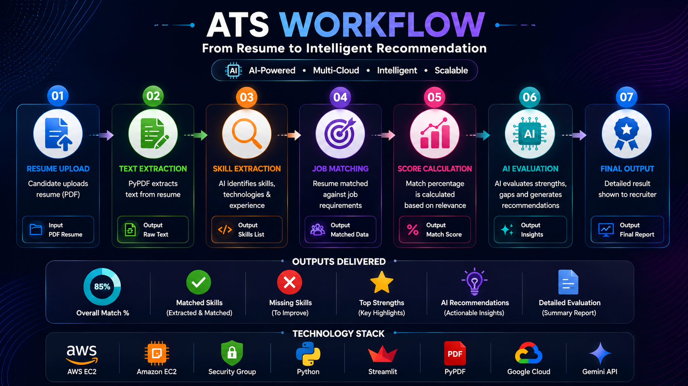
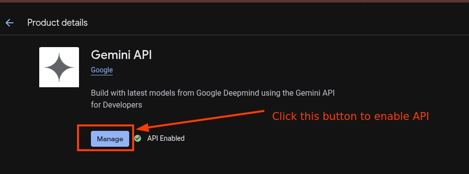
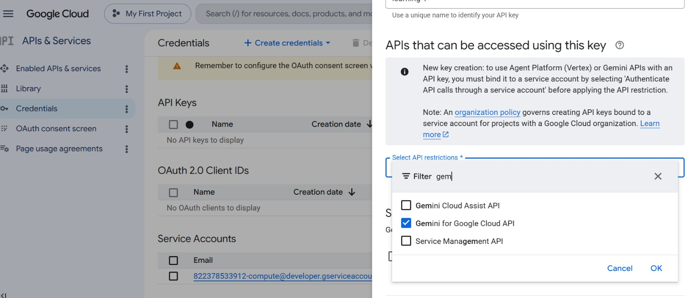
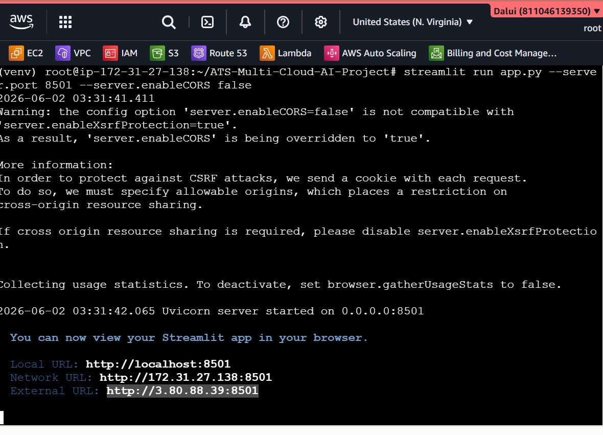
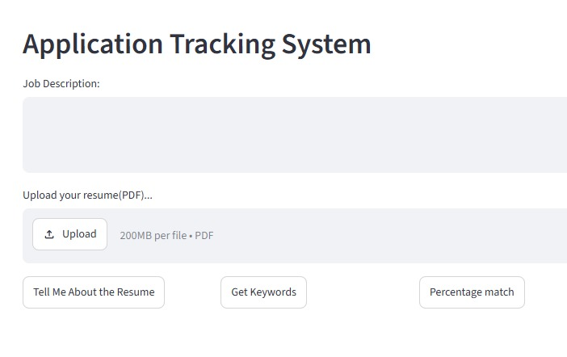
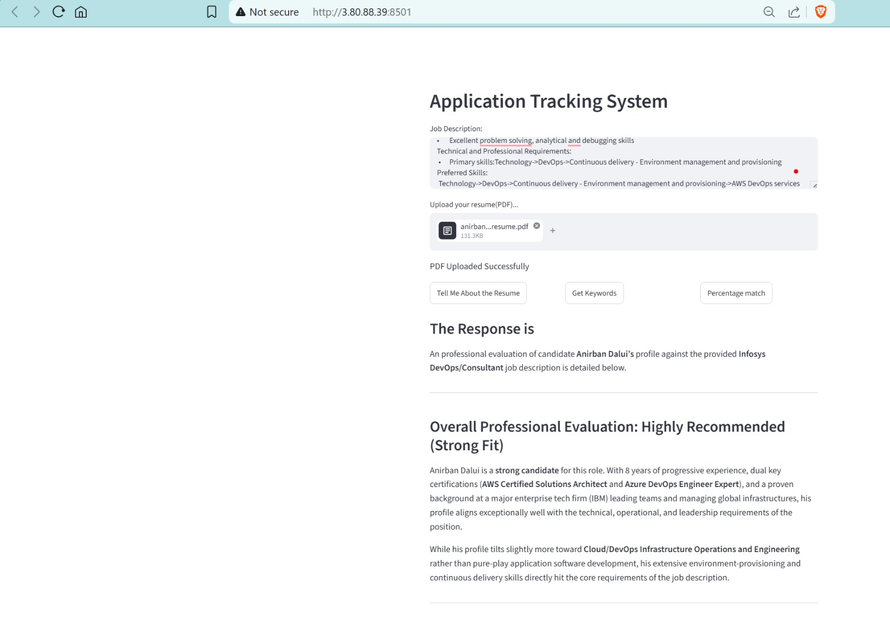

# 🚀 ATS Multi-Cloud AI Platform

<p align="center">


</p>


> AI-Powered Applicant Tracking System (ATS) deployed on AWS and integrated with Google Gemini AI for intelligent resume analysis, keyword extraction, skill matching, and candidate evaluation.

---

<p align="center">
  
</p>
<p align="center">

</p>


---

## 💼 Business Problem

Recruiters and hiring managers often spend hours manually screening resumes against job descriptions.

Common challenges:

- Manual candidate evaluation
- Time-consuming resume screening
- Missing qualified candidates
- Skill gap identification
- Inconsistent assessment process

---

## 💡 Solution

The ATS Multi-Cloud AI Platform automates the recruitment screening process using Generative AI.

The application:

- Uploads candidate resumes (PDF)
- Extracts resume content
- Analyzes job descriptions
- Identifies relevant skills
- Calculates job match percentage
- Detects missing skills
- Generates AI-powered recommendations
- Produces recruiter-ready evaluations

---

## 🏗 Architecture Overview

| Component | Purpose |
|------------|------------|
| AWS EC2 | Hosts Streamlit ATS Application |
| Streamlit | User Interface |
| PyPDF | Extract Resume Content |
| Gemini AI | Skill Analysis & Evaluation |
| Google Cloud API | AI Processing |
| Recruiter Dashboard | Final Candidate Assessment |

---

### Cloud Responsibilities

#### AWS

- Application Hosting
- Resume Processing
- User Interaction
- Runtime Environment

#### Google Cloud

- Generative AI Processing
- Candidate Evaluation
- Skill Extraction
- Match Percentage Analysis

---


## 🌟 Project Highlights

✅ Multi-Cloud Integration (AWS + Google Cloud)

✅ AI-Powered Resume Analysis using Gemini AI

✅ Automated Skill Matching & Candidate Evaluation

✅ Real-Time Resume Processing

✅ AWS EC2 Deployment

✅ Streamlit-Based Web Interface

✅ PDF Resume Parsing with PyPDF

✅ Recruiter-Friendly Candidate Assessment

---

## 🔄 Request Flow

<p align="center">
  
</p>

---

## ⚙️ ATS Workflow

<p align="center">
  
</p>

---

## 🛠 Technology Stack

| Category | Technology |
|-----------|-----------|
| ☁️ Cloud Platform | AWS EC2 |
| 🤖 AI Engine | Google Gemini AI |
| 🐍 Programming Language | Python |
| 🎨 Frontend | Streamlit |
| 📄 Document Processing | PyPDF |
| 🔐 Authentication | API Key |
| 🌐 Version Control | Git & GitHub |
| 💻 Operating System | Ubuntu Linux |

---

## 📂 Repository Structure

```text
ATS-Multi-Cloud-AI-Platform/
│
├── app/
│   ├── app.py
│   ├── index.html
│   ├── requirements.txt
│   └── packages.txt
│
├── architecture/
│   ├── multicloud-architecture.png
│   ├── request-flow.png
│   └── ats-workflow.png
│
├── screenshots/
│   ├── 02-gemini-api-enabled.png
│   ├── 03-api-key-created.png
│   ├── 04-streamlit-running.png
│   ├── 05-ats-homepage.png
│   └── 06-final-result.png
│
├── docs/
│   └── troubleshooting.md
│
└── README.md

```

## 📋 Prerequisites

- AWS Account
- Google Cloud Account
- Gemini API Enabled
- Ubuntu EC2 Instance
- Python 3.x

```

## 📊 Project Metrics

| Metric | Value |
|---------|---------|
| Cloud Provider | AWS |
| AI Platform | Google Gemini |
| Architecture | Multi-Cloud |
| Deployment Model | EC2 Hosted |
| Resume Format | PDF |
| Frontend | Streamlit |
| Language | Python |

```

## 🚀 Deployment Guide

### Step 1 – Launch EC2

```
sudo -i
```

### Step 2 – Install Dependencies

```
apt update
apt install python3-pip python3-venv git -y
```

### Step 3 – Clone Repository

```
git clone https://github.com/YOUR_USERNAME/ATS-Multi-Cloud-AI-Platform.git
cd ATS-Multi-Cloud-AI-Platform/app
```

### Step 4 – Create Virtual Environment

```
python3 -m venv .venv
source .venv/bin/activate
```

### Step 5 – Install Packages

```
pip install -r requirements.txt
```

### Step 6 – Configure Gemini API

```
mkdir -p .streamlit
vi .streamlit/secrets.toml
```

```
GOOGLE_API_KEY = "YOUR_API_KEY"
```

### Step 7 – Start Application

```
streamlit run app.py --server.port 8501 --server.address 0.0.0.0
```

### Step 8 – Open Security Group

Port 8501 (Custom TCP)

### Step 9 – Access Application

```
http://PUBLIC_IP:8501
```


---
## 📸 Application Screenshots

### Gemini API Enabled



### API Key Configuration



### Streamlit Startup



### ATS Homepage



### Final Evaluation


---

## 🔐 Security Considerations

- Never commit API keys
- Restrict Security Group access
- Rotate compromised credentials
- Use environment variables where possible
- Apply least-privilege principles

## ⚡ Challenges & Learnings

### Multi-Cloud Communication
Established secure communication between the AWS-hosted application and the Google Gemini API.

### Resume Parsing Accuracy
Handled different resume formats and PDF structures.

### AI Prompt Engineering
Designed prompts to generate consistent candidate evaluations and match scores.

### Security Configuration
Configured EC2 Security Groups and API authentication securely.

### Production Deployment
Managed application deployment and external accessibility on AWS EC2.


## 👨‍💻 Author

**Anirban Dalui**

Cloud & DevOps Engineer

AWS Certified Solutions Architect Associate

Azure DevOps Engineer Expert

---

## ⭐ Support

<p align="center">

⭐ If you found this project useful, consider starring the repository.

🚀 Built to demonstrate Multi-Cloud Architecture, AI Integration, and Cloud Deployment skills.

</p>
